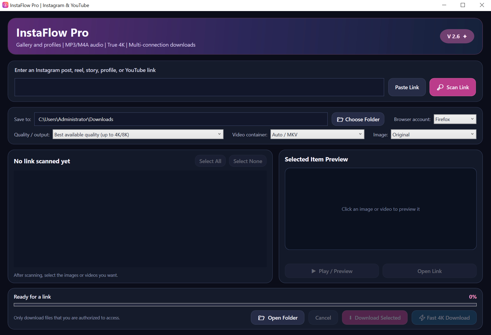

# InstaFlow Pro

A PowerShell-based desktop downloader for Instagram and YouTube with support for high-quality media downloads, accelerated transfers, and 4K video when available.

## Features

- YouTube video and audio downloads
- Instagram media downloads
- Instagram gallery support
- Instagram profile-related functions
- High-quality and 4K downloads when available
- Automatic best-quality format selection with `yt-dlp`
- Multi-connection downloading with `aria2c`
- Automatic fallback to the native `yt-dlp` downloader if `aria2c` fails
- Video and audio merging with `FFmpeg`
- Original media streams are preserved without re-encoding when possible
- Browser cookie access through supported browsers
- Download folder selection
- Graphical PowerShell interface
- Windows desktop shortcut installation

## Accelerated 4K Downloads

The **Accelerated 4K** option uses:

- `yt-dlp` for media detection and format selection
- `aria2c` for optional multi-connection downloading
- `FFmpeg` for merging separate video and audio streams

This avoids relying on temporary signed CDN URLs that may expire or return HTTP `403` errors.

If `aria2c` fails, InstaFlow automatically retries the download using the native `yt-dlp` downloader.

Multi-connection downloading may improve download speed, but faster speeds are not guaranteed.

## Requirements

InstaFlow Pro is designed for Windows.

Depending on the requested operation, the following tools may be required:

- PowerShell
- `yt-dlp`
- `FFmpeg`
- `aria2c` - optional acceleration
- `gallery-dl` - used for supported Instagram gallery and profile operations

The installer can download or configure some required tools automatically.

## Installation

1. Download or clone this repository.
2. Extract the files to a normal folder if using a ZIP archive.
3. Run `Install.bat`.
4. Wait for installation to complete.
5. Open the **InstaFlow Pro** desktop shortcut.

The application files are installed under the current Windows user's local application data directory.

## Running Without Reinstalling

The project also includes:

- `Open_InstaFlow.bat`
- `Open_InstaFlow.vbs`

These files can be used to launch InstaFlow directly.

## Basic Usage

1. Open InstaFlow Pro.
2. Paste a supported Instagram or YouTube URL.
3. Scan the URL.
4. Select the media items you want.
5. Choose the desired quality and output options.
6. Select a download folder if necessary.
7. Start the download.

The default download location is the current user's Windows `Downloads` folder.

## Accelerated Download Workflow

For supported YouTube content, InstaFlow follows this process:

1. Receive the media URL.
2. Use `yt-dlp` to detect the available formats.
3. Select the best available video and audio streams.
4. Attempt an accelerated download using `aria2c`.
5. Use `FFmpeg` to merge video and audio when necessary.
6. Save the final media file.

If accelerated downloading with `aria2c` fails, InstaFlow automatically falls back to the native `yt-dlp` downloader and continues the download without requiring the user to restart the process.

## Browser Cookies

InstaFlow can use browser cookies through `yt-dlp` and `gallery-dl` when required for supported content.

Cookies are read from the selected browser at runtime.

Browser cookies, passwords, authentication tokens, and account credentials are not stored in this repository.

## Instagram Notes

Instagram may apply rate limits or temporary restrictions.

For example, HTTP `429` responses may temporarily prevent some profile or media operations.

Availability can also depend on:

- Whether the content is public
- Whether authentication is required
- Instagram rate limits
- Browser login state
- Changes made by Instagram

## YouTube Notes

Available quality depends on the source video.

If a video provides separate high-resolution video and audio streams, InstaFlow uses `yt-dlp` and `FFmpeg` to download and merge them.

The maximum resolution may include 4K when the original video provides it.

Some content may require browser authentication or may be restricted by YouTube policies, region, age, account permissions, or content rights.

## Why Not IDM for 4K?

For some YouTube videos, browser download extensions may only expose lower-resolution streams such as 1080p.

Temporary signed media URLs can also expire or return `403 Forbidden` when passed to another downloader.

InstaFlow Pro therefore uses `yt-dlp` directly for format selection and download management instead of depending on temporary CDN links.

This project is not an IDM integration.

## Project Structure

- `.gitignore`
- `GUIDE.md`
- `InstaFlow.ico`
- `InstaFlow.ps1`
- `Install.bat`
- `Install.ps1`
- `Merge_IDM.ps1`
- `Open_InstaFlow.bat`
- `Open_InstaFlow.vbs`
- `README.md`
- `Update_Tools.bat`
- `Worker.ps1`

## Main Files

### `InstaFlow.ps1`

Main graphical user interface and application controller.

### `Worker.ps1`

Handles media scanning, metadata processing, downloads, format selection, and external tool integration.

### `Install.ps1`

Installs InstaFlow and prepares required or optional tools.

### `Install.bat`

Simple Windows installer launcher.

### `Update_Tools.bat`

Used to update or install supporting tools.

### `Merge_IDM.ps1`

Utility for manually merging separate video and audio downloads when needed.

### `GUIDE.md`

Additional Persian-language usage instructions.

## Temporary Files

Runtime job, status, metadata, and result files are created inside the Windows temporary directory.

These temporary files are not part of the source repository.

## Privacy and Security

The repository contains application source code only.

It does not intentionally include:

- Browser cookies
- Passwords
- Authentication tokens
- User account credentials
- Downloaded media
- Temporary signed media URLs

Temporary signed media URLs should not be treated as permanent download links.

## Updating the Project

After updating the source files, existing installations may need to run `Install.bat` again so the installed copy receives the latest project files.

Supporting tools can also be updated with `Update_Tools.bat`.

## Disclaimer

Use this software only to access and download content that you are authorized to access.

Users are responsible for complying with applicable laws, copyright rules, platform terms, and content-owner rights.

YouTube, Instagram, IDM, yt-dlp, aria2c, FFmpeg, and gallery-dl are separate projects or services and are not affiliated with this repository.

